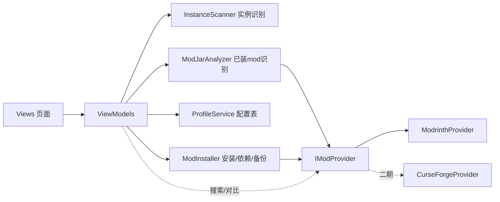

## 用户需求

用户玩 Minecraft 整合包时，经常需要把自己常用但整合包里没有的 mod 挨个手动添加。由于 MC 版本、mod 加载器（Forge/Fabric/Quilt/NeoForge）、mod 版本组合繁多，每次换新整合包都很繁琐。希望开发一款 Windows 桌面软件，自动识别整合包实例信息，基于预先配置的 mod 清单（配置表），一键补全缺失的 mod。

## 产品概述

一款中文图形界面的 Minecraft mod 批量添加工具（工作名 McModsAdder）。核心流程：自动扫描/手动选择整合包实例 → 识别游戏版本、加载器类型、mods 文件夹及已装 mod → 与选中的配置表对比 → 按实例的版本和加载器自动从 Modrinth 下载匹配文件并补装缺失 mod（含必需依赖）。配置表只记录 mod 项目（界面显示名字，底层存项目 ID），不绑定版本与加载器，因此一张表可复用于任意整合包。

## 核心功能

1. **实例识别**：自动扫描 `.minecraft/versions/` 下版本隔离实例（兼容 PCL/HMCL），支持手动选择整合包目录；解析实例 JSON 判定 MC 版本与加载器类型（fabric/forge/quilt/neoforge），定位 mods 目录（含一级子目录，跳过 .disabled 文件）。
2. **已装 mod 识别**：优先用 jar 的 sha1 哈希调用 Modrinth 批量查询精确匹配（重命名 jar 也能识别）；未命中则解析 jar 内 `fabric.mod.json`/`META-INF/mods.toml`/`quilt.mod.json`/`mcmod.info` 兜底展示。
3. **配置表管理**：通过 Modrinth 搜索添加 mod 形成配置表，支持多个配置表；支持 JSON 导入导出（分享/备份）。
4. **对比视图**：针对当前实例展示配置表内 mod 的状态（已装/缺失/该平台无此实例版本可用）。
5. **一键补装**：按实例版本+加载器下载匹配的最新文件，自动递归补装必需依赖（防循环依赖与重复安装）；写入前备份，显示下载进度与结果清单。
6. **设置**：API 基地址可切换 Modrinth 官方/MCIM 国内镜像、下载并发数、备份目录；架构预留 CurseForge Provider 扩展点（二期接入）。

## 技术选型

- **语言/运行时**：C# + .NET 8（Windows 桌面，长期支持版本）
- **UI 框架**：WPF + WPF-UI（lepo.co，Fluent Design 2 风格控件库），深色 Mica 主题，满足"良好图形界面"要求且 Windows 原生体验最佳；不选 Avalonia 是因为目标平台仅 Windows，WPF 生态更成熟
- **MVVM**：CommunityToolkit.Mvvm（源生成器，减少样板代码）
- **HTTP**：HttpClient（单例 + HttpClientFactory 模式），System.Text.Json 反序列化
- **jar 解析**：System.IO.Compression（jar 即 zip）；mods.toml 用 Tomlyn 解析
- **持久化**：本地 JSON 文件（`%APPDATA%/McModsAdder/`），配置表导出为独立 JSON
- **打包**：单文件发布（win-x64 self-contained 或 framework-dependent）

## 实现方案

核心策略参考已验证可行的 ferium 模式：配置表存"项目标识"而非版本文件，安装时按实例的 MC 版本+加载器实时查询匹配文件。在此之上补齐 ferium 缺失的能力：实例自动识别与 GUI。

### 关键决策与理由

1. **IModProvider 抽象**：ModrinthProvider 实现搜索/版本查询/哈希识别/下载；CurseForgeProvider 二期实现同一接口（需 API key 与分发限制降级逻辑）。符合开闭原则，避免一期就为 CF 付出 40% 成本。
2. **实例识别**：扫描 versions 目录找候选实例 → 读 `<实例名>.json` → 综合 `inheritsFrom`、`mainClass`、`libraries` 坐标判定加载器与 MC 版本（HMCL 合并式 json 与继承式均兼容）；加载器版本不可考时不影响主流程（Modrinth 按 MC 版本+加载器类型过滤即可）。
3. **已装 mod 识别**：两阶段。阶段一：对所有 jar 算 sha1，`POST /v2/version_files` 一次批量请求匹配（O(n) 哈希 + O(1) 网络），命中即得 project id 与版本号；阶段二：未命中 jar 仅解析内部元数据用于列表展示与名称模糊对比。性能：200 个 mod 约秒级哈希 + 1 次 API 调用，瓶颈在磁盘 IO，用并行哈希缓解。
4. **依赖解析**：Modrinth 版本对象含 `dependencies`（type=required）。安装前做 BFS 依赖闭包收集，visited 集合防循环，与"已装+待装"集合去重；找不到匹配版本的必需依赖列入"不可自动安装"清单提示用户。
5. **Quilt 回退**：实例为 Quilt 时查询 loaders=["quilt","fabric"]（Modrinth 支持多数组过滤，优先 quilt 结果）。
6. **写入安全**：下载到临时目录校验 sha1 后再移入 mods 目录；被替换/重复的旧 jar 移入 `mods/.mcmodsadder-backup/<时间戳>/`；全程写操作日志（不含敏感信息，错误可定位）。

### 性能与可靠性说明

- 搜索加防抖（300ms）；项目信息内存缓存避免重复请求。
- 下载并发可配（默认 4），单文件失败不阻断整体，最终汇总失败原因。
- API 基地址可切换 MCIM 镜像（mcimirror.top，完全兼容官方接口），解决国内访问不稳。

## 架构设计

分层：Views（XAML）→ ViewModels（MVVM 绑定）→ Services（领域服务）→ Providers（外部 API）→ Models（DTO/领域模型）。



## 目录结构

全新项目，在空工作区从零搭建：

```
f:/Codebuddy/MCmodsadder/
├── McModsAdder.sln                       # [NEW] 解决方案
└── src/McModsAdder/
    ├── McModsAdder.csproj                # [NEW] .NET 8 WPF 项目：引用 WPF-UI、CommunityToolkit.Mvvm、Tomlyn
    ├── App.xaml / App.xaml.cs            # [NEW] 应用入口：DI 容器（Microsoft.Extensions.DependencyInjection）、主题加载、HttpClient 注册
    ├── MainWindow.xaml(.cs)              # [NEW] 主窗口：WPF-UI NavigationView 承载页面导航
    ├── Models/
    │   ├── GameInstance.cs               # [NEW] 实例模型：路径、名称、MC版本、加载器枚举、mods目录、已装mod列表
    │   ├── InstalledMod.cs               # [NEW] 已装mod：文件名、sha1、命中projectId/slug/版本号、兜底元数据(modId/名称/版本)、识别方式枚举
    │   ├── ModProfile.cs                 # [NEW] 配置表：名称、条目列表（slug/projectId/显示名/图标url/添加时间）
    │   └── Dto/ModrinthDtos.cs           # [NEW] Modrinth 搜索/项目/版本/文件/依赖 DTO（System.Text.Json）
    ├── Services/
    │   ├── IModProvider.cs               # [NEW] Provider 抽象（见 Key Code Structures），CF 二期实现
    │   ├── InstanceScanner.cs            # [NEW] 自动扫描 versions 目录+手动目录校验；解析实例 json 判定加载器与 MC 版本；定位 mods 目录（含一级子目录、跳过 .disabled）
    │   ├── ModJarAnalyzer.cs             # [NEW] 并行 sha1 哈希 + 批量 version_files 匹配；未命中解析 fabric.mod.json/mods.toml/quilt.mod.json/mcmod.info
    │   ├── ProfileService.cs             # [NEW] 配置表 CRUD、多表管理、JSON 导入导出（含格式校验与重复条目合并）
    │   ├── ModInstaller.cs               # [NEW] 缺失清单计算、BFS 依赖闭包解析、临时目录下载+校验+落盘、旧文件备份、并发与进度报告（IProgress）
    │   └── SettingsService.cs            # [NEW] 设置持久化：API 基地址（官方/MCIM 镜像）、并发数、备份开关
    ├── Providers/
    │   └── ModrinthProvider.cs           # [NEW] 实现 IModProvider：/v2/search、/v2/project/{id}、/v2/project/{id}/versions?game_versions&loaders、/v2/version_files 批量哈希、文件下载；重试与镜像基地址
    ├── ViewModels/
    │   ├── InstancesViewModel.cs         # [NEW] 实例列表页：扫描、手动添加、刷新、选中实例
    │   ├── InstanceDetailViewModel.cs    # [NEW] 详情页：已装 mod 列表、配置表选择、对比结果（已装/缺失/不可用）
    │   ├── ProfilesViewModel.cs          # [NEW] 配置表列表：新建/重命名/删除/导入/导出
    │   ├── ProfileEditorViewModel.cs     # [NEW] 配置表编辑：Modrinth 搜索（防抖）、添加/移除条目
    │   ├── InstallViewModel.cs           # [NEW] 安装页：缺失清单确认、进度、结果与失败原因
    │   └── SettingsViewModel.cs          # [NEW] 设置页
    ├── Views/                            # [NEW] 上述各页面对应的 XAML UserControl（卡片式实例列表、对比表格、搜索结果列表、进度面板）
    └── Converters/                       # [NEW] 枚举/状态到图标与颜色的值转换器
```

## Key Code Structures

```
public interface IModProvider
{
    Task<IReadOnlyList<ModSearchResult>> SearchAsync(string query, int limit, CancellationToken ct);
    Task<ModProjectInfo> GetProjectAsync(string idOrSlug, CancellationToken ct);
    // 按 MC 版本+加载器取最新匹配版本（含文件列表与 dependencies）
    Task<ModVersionInfo?> GetBestVersionAsync(string idOrSlug, string gameVersion, ModLoader loader, CancellationToken ct);
    // 批量 sha1 -> 命中 project/version；未命中不出现在返回中
    Task<IReadOnlyDictionary<string, ModVersionInfo>> MatchHashesAsync(IReadOnlyCollection<string> sha1Hashes, CancellationToken ct);
    Task DownloadAsync(string url, string destPath, string expectedSha1, IProgress<long> progress, CancellationToken ct);
}

public enum ModLoader { Unknown, Fabric, Forge, Quilt, NeoForge }
// Quilt 查询时 providers 侧自动回退附加 fabric 过滤；1.20.2+ Forge 与 NeoForge 严格区分
```

## 应用类型与总体风格

Windows 桌面应用（Web 为桌面端设计），采用 Fluent Design 2 深色主题 + Mica 亚克力背景，点缀 Minecraft 风格的"绿宝石/草方块绿"作为品牌强调色，营造现代、精致、有游戏氛围的第一印象。所有页面共用左侧 NavigationView 导航。

## 页面规划（共 6 屏）

1. **实例页（首页）**：顶部操作区（自动扫描、手动选择目录、刷新按钮）；中部实例卡片网格，卡片显示实例名、MC 版本徽章、加载器彩色徽章（Fabric 米黄/Forge 深蓝/Quilt 紫/NeoForge 橙）、mod 数量；卡片悬停浮起动画，点击进详情。
2. **实例详情页**：顶部实例信息横幅（路径、版本、加载器）+ 配置表选择下拉框；主体为对比表格，行内状态标签（已装-绿/缺失-黄/无可用版本-红）带图标；底部固定操作栏："一键补装缺失 mod"主按钮 + 缺失数统计。
3. **配置表管理页**：左列配置表列表（新建/重命名/删除/导入/导出按钮），右侧预览选中表的 mod 条目网格（图标+名称）；空态引导插画与文案。
4. **配置表编辑页**：顶部搜索框（防抖）+ 结果列表（图标、名称、简介、下载量，行尾"添加"按钮）；下方已选条目列表，可移除；添加时按钮变为对勾并微动效。
5. **安装进度页**：待装清单确认面板（含自动补装的依赖单独标注"依赖"徽章）；环形总进度 + 每文件进度条；完成后结果卡片（成功数、失败原因、不可用清单、备份位置）。
6. **设置页**：API 源选择（Modrinth 官方 / MCIM 镜像）、下载并发数滑块、备份开关与目录、关于信息。

## 交互与动效

页面切换使用 WPF-UI 自带过渡；按钮/卡片 hover 有柔和抬升与阴影；状态徽章加载完成后淡入；下载进度平滑动画；危险操作（删除配置表）使用 ContentDialog 二次确认。